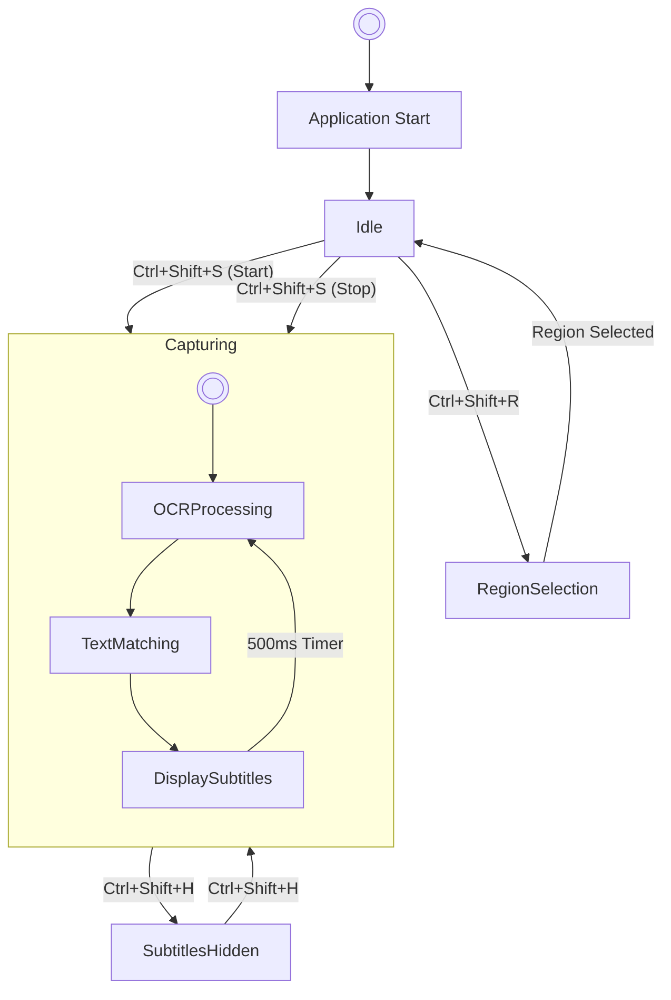
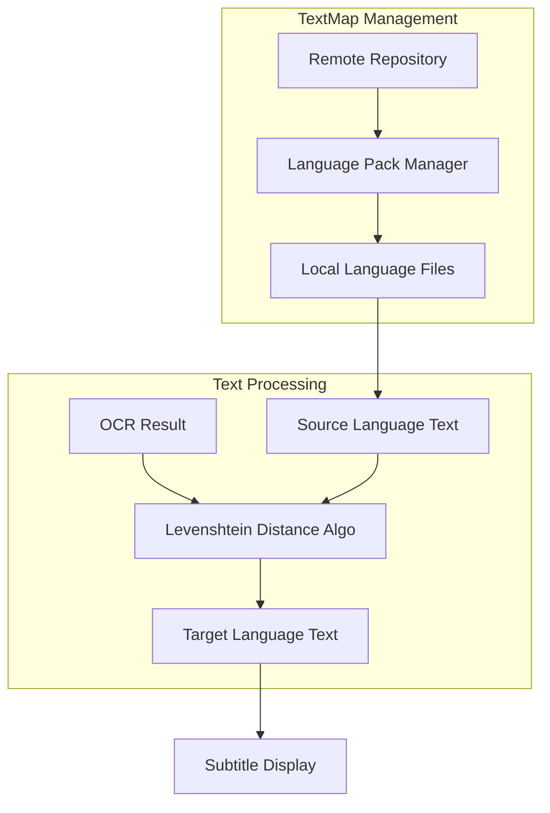

# Genshin-Subtitles Documentation

[**DeepWiki**](https://deepwiki.com/qew21/Genshin-Subtitles)

[**English**](./README.md) | [**中文简体**](./README_CN.md)

## Overview

Genshin-Subtitles is an OCR-based application that provides real-time multi-language subtitles for games such as Genshin Impact and Honkai: Star Rail. It captures game text using optical character recognition technology, matches it against known text databases, and displays translated subtitles in a configurable overlay.

For detailed information about the system architecture and components, see [Architecture](#architecture). For information about the OCR implementation, see [OCR Engine](#ocr-engine).

### Core Functionality

Genshin-Subtitles enables players to:

1. Display dual-language subtitles during gameplay.
2. Enjoy voice acting in one language while reading text in another.
3. Select specific screen regions for text recognition.
4. Configure subtitle appearance, position, and language preferences.
5. Optionally play AI-synthesized voice audio for certain content.

### System Requirements

- 64-bit CPU with AVX instruction set support (required by PaddleOCR)
- Windows operating system
- .NET Framework 4.5.2 or higher
- Compatible games: Genshin Impact, Honkai: Star Rail

### Technical Implementation

Genshin-Subtitles employs a sophisticated pipeline to achieve real-time subtitle translation. It captures game text, processes it using OCR, matches it against known translations, and displays the results as subtitles.

### Key Components

| Component          | Description                                                                 |
|--------------------|-----------------------------------------------------------------------------|
| OCR Engine         | PaddleOCRSharp for text recognition from screen captures                    |
| Image Processor    | Enhances captured images to improve recognition accuracy                    |
| Text Matcher       | Uses Levenshtein distance algorithm to match OCR results with known game text|
| Language Maps      | JSON files containing game text in multiple languages                        |
| Subtitle Overlay   | Customizable UI component for displaying translated text                    |
| System Tray Interface| Controls for configuring the application                                   |
| Hotkey System      | Keyboard shortcuts for controlling operation during gameplay                 |

### User Interaction Model

The application uses a dual-timer architecture to separate OCR processing from UI updates, ensuring smooth operation. Users can control the application using hotkeys and the system tray interface.

### Language Support

Genshin-Subtitles supports translation between various languages, including Chinese, English, Japanese, Korean, and other languages supported by the games (up to 13 total). Translation is accomplished by matching recognized text against a database of game dialogues in various languages.

### Version History

- Version 1.4.X: Current version
- Version 1.3.0: Added AI voice playback, subtitle hiding, and improved region selection
- Version 1.2.0: Added hotkey controls, region selection, and performance improvements
- Version 1.1.0: Added Star Rail support and multiple language options
- Version 1.0.0: Initial release with Chinese-English support

### Integration with Game Systems

The application functions as an external overlay that captures visual information from the game window, processes the captured images to extract text, matches extracted text against known game dialogue, and displays translated text as an overlay. This approach ensures compatibility across game versions and updates.

### Technical Foundation

Genshin-Subtitles is built on several key technologies:

- PaddleOCRSharp: Provides the OCR capabilities for text recognition
- Windows Presentation Foundation (WPF): Powers the user interface
- Levenshtein distance algorithm: Enables fuzzy matching of recognized text
- JSON processing: Handles the language pack data structures
- Image processing: Enhances OCR accuracy through preprocessing techniques

The application maintains a minimal footprint while providing powerful functionality for multi-language game subtitle display.